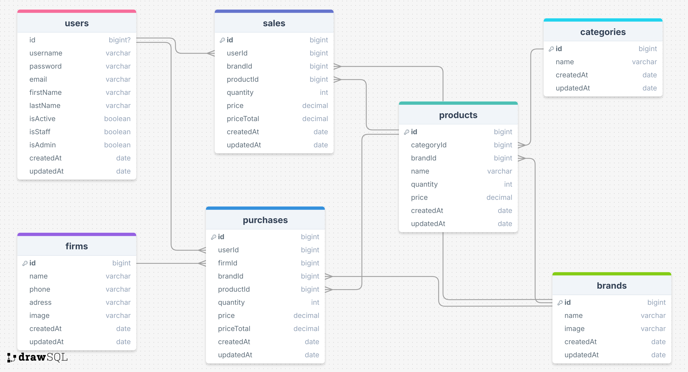

# HANAKO STOCKS 

## Stock Management System <a href="https://emoji.gg/emoji/6627-march7th-shopping"></a>

- The Stock Management System is a web application developed to facilitate inventory tracking and management; designed for the [Hanako Store](https://hanako-store-1041.netlify.app). 

- The backend portion of this application provides a RESTful API server that enables users to manage their stock operations. The API supports functionality related to brands and purchases, among other inventory management features. Users can add, update, delete, and search for stock items. Additionally, they can filter stock items based on different categories and suppliers. The user authentication and authorization system assigns different user roles, each with specific levels of permissions. This ensures secure and effective collaboration among users.

- If you prefer to see Redoc or JSON instead of Swagger, simply replace 'swagger' in the endpoint with 'redoc' or 'json'.
   <!-- there will be link here -->





## Tools and frameworks used:

- **Express.js:** Fast and flexible Node.js web application framework.
- **MongoDB:** Flexible and scalable NoSQL database solution.
- **Mongoose:** Object Data Modeling (ODM) library for MongoDB.
- **Logging:** Logging functionality is integrated to track application activities and errors.
- **Swagger/Redoc:** Documentation is generated using Swagger or Redoc to provide API documentation in an interactive and user-friendly manner.
- **JSON File Creation:** JSON files are created to store data or configurations for various purposes.
- **Token-based Authentication:** Token-based authentication mechanism is implemented to ensure secure communication between client and server, enhancing overall application security and user authentication.
- **Dotenv:** Node.js module used for loading environment variables.
- **Express-async-errors:** Helper module for asynchronous error handling in Express applications.
- **CRUD Operations** Users can create, read, update, and delete books from the database.
- **Middleware** Middleware functions are implemented to handle requests, perform validations, and enhance security.
- **Morgan** HTTP request logging middleware for Node.js. It generates log files for HTTP requests, providing valuable insights into how your application is functioning by recording details of incoming and outgoing HTTP requests.
- **Multer** A versatile file upload middleware for Node.js. This package retrieves files from HTTP requests and uploads them to the server. It supports features such as multiple file uploads, file size limits, and file type restrictions.
- **Nodemailer** A Node.js library for sending emails. Nodemailer simplifies the process of sending emails via an SMTP server. It supports features like email templates, attachments, and HTML formatting.


## Project Structure:

```
Stock Management System/
  ├── index.js          
  ├── .env
  ├── public
  ├    ┣ static
  ├    ┣ index.html   
  ├── src
      ┣ configs
      ┃ ┗ dbConnection.js
      ┃ ┣ swagger.json
      ┣ controllers
      ┃ ┣ auth.js
      ┃ ┣ brand.js
      ┃ ┣ category.js
      ┃ ┣ firm.js
      ┃ ┣ product.js
      ┃ ┣ purchase.js
      ┃ ┣ sale.js
      ┃ ┣ token.js
      ┃ ┗ user.js
      ┣ helpers
      ┃ ┣ sync.js
      ┃ ┣ sendMail.js
      ┃ ┗ paswordEncrypte.js
      ┣ middlewares
      ┃ ┣ authentication.js
      ┃ ┣ errorHandler.js
      ┃ ┣ logger.js
      ┃ ┣ permissions.js
      ┃ ┣ upload.js
      ┃ ┗ queryHandler.js
      ┣ models
      ┃ ┣ brand.js
      ┃ ┣ category.js
      ┃ ┣ firm.js
      ┃ ┣ product.js
      ┃ ┣ purchase.js
      ┃ ┣ sale.js
      ┃ ┣ token.js
      ┃ ┗ user.js
      ┣ routes
      ┃ ┣ auth.js
      ┃ ┣ brand.js
      ┃ ┣ category.js
      ┃ ┣ document.js
      ┃ ┣ firm.js
      ┃ ┣ index.js
      ┃ ┣ product.js
      ┃ ┣ purchase.js
      ┃ ┣ sale.js
      ┃ ┣ token.js
      ┃ ┗ user.js
      
  ├── swaggerAutogen.js
  ├── package.json   
  └── README.md       
```

## Prerequisites

This is an example of how to list things you need to use the software and how to install them.

- npm
  ```sh
  npm install npm@latest -g
  ```

## Installation

_Below is an example of how you can instruct your audience on installing and setting up your app. This template doesn't rely on any external dependencies or services._

1. Clone the repo:
   ```sh
   git clone https://github.com/psyBeth/Hanako-Stocks-BE.git
   ```
   GitHub CLI:
    ```sh
    gh repo clone psyBeth/Hanako-Stocks-BE
    ```
2. Install NPM packages
   ```sh
   npm install
   ```
3. Create .env file in home directory.
   ```sh
   HOST=localhost
   PORT=8000
   MONGODB=ENTER YOUR Database adres or local: mongodb://127.0.0.1:8000/hanako-stocks-be
   SECRET_KEY=ENTER YOUR random letters and number, for example: jsl78dd9ff6f6s9jkd89Kkfnfd
   ACCESS_KEY=ENTER YOUR random letters and number, for example: jsl78dd9ff6f6s9jkd89Kkfnfd
   REFRESH_KEY=ENTER YOUR random letters and number, for example: jsl78dd9ff6f6s9jkd89Kkfnfd
   PAGE_SIZE=25

   ```
4. Logs File
   ```sh
   You can write:
   mkdir logs
   ```
5. The project is ready, you can start using it now.
   ```sh
   You can run:
   nodemon index
   ```

### IMPORTANT NOTES ! 

To use the application, you can log in with the following email and password <br>
email: admin@site.com <br>
password: aA?123456 <br>


## *** to do list ***

- test: login and user auth testing
- debug: errors on user controller will be fixed
- chore: swagger info will be written in readme